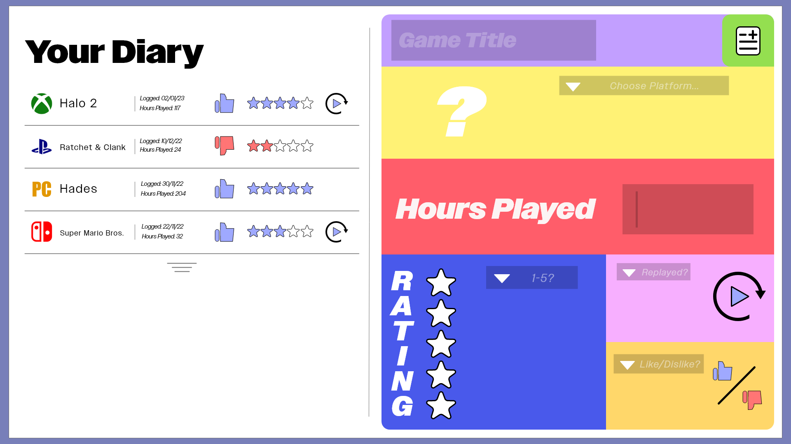

# zask8052-tracker

My name is Zander, and in this README file, I will document my process in creating my Web Design Prototype, based on the Design Prompt of 'Media Consumption'. For this prompt, I chose to create a 'Video Game Review' data tracking application.

Firstly, I went through the process of creating a repository, utilising GitHub to set it up. I followed the in-class instructions, only coming across one issue, being that the local server was not connecting, which was swiftly fixed once I asked the tutor for assistance.

After this I began building the website's structure using HTML. I first looked at my Design Concept created for my previous assessment task, in which I was tasked in designing the possible layout for this tracking site, seen here:

